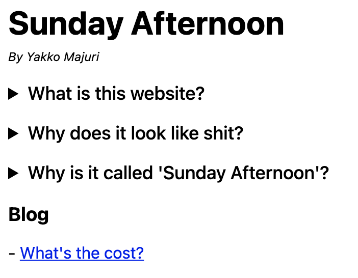

# Why I built my own static site generator

<details>

<summary><b>TL;DR</b></summary>

<br />

I really wanted to get a personal blog up quickly, but the most popular static site generators either didn't fit my needs or did way too much.

As a result, I built [Teeny](https://github.com/yakkomajuri/teeny).

It took me a couple hours, so it certainly isn't anything amazing, but if you want to try it, you can do:

```
npm i -g teeny-cli
teeny init && teeny develop
```

</details>

<details open>

<summary><b>The backstory</b></summary>

<br />

The website you're currently on was built using a static site generator called [Teeny](https://github.com/yakkomajuri/teeny).

Until yesterday, Teeny wasn't even an idea. It didn't exist at all, not even in my mind.

You see, for a long time I've been wanting to launch a personal blog.

I used to be a [regular writer of technical content](https://yakkomajuri.medium.com/) (which I unfortunately don't find a lot of time for these days), but I was yearning for a home to publish more unpolished, personal, "stream of consciousness" pieces.

I love writing, and just want to have something to motivate me to keep on doing it, even if nobody's reading.

The problem is, I suffer from a condition most programmers are awfully familiar with: a knack for adding more and more scope to side projects, to the point where they get dropped and never see the light of day.

On so many weekends I started building a blog using all the right tools and technologies, writing clean code, making it "spark joy", and then got to Sunday evening with yet another repo in hand that I'd never revisit.

So a few weeks ago, I broke the cycle. I published this:



It was a poorly-coded ugly thing written in vanilla HTML. But it was much better than everything else for a simple reason: it went live.

This was a great start, but, unfortunately, it did lack the one thing I'd want for my blog: the ability to write in Markdown.

Markdown is the best thing since sliced bread, so my blog could suck, but it better be able to parse Markdown.

So I turned to Jekyll. Jekyll is natively supported by GitHub Pages, and with a few clicks in the GitHub UI you're all up and running.

This was nice, but I lost the flexibility I would have wanted to customize the pages a bit - GitHub let's you pick a theme and that's that.

This was a result of the native integration with GitHub pages - if I had set Jekyll up myself I'd have had the control I needed. But I'm not a big fan of Ruby tools, so I scrapped that idea.

So, once again, I turned to a tool I'm actually reasonably familiar with: Gatsby.

Gatsby is great, and I've worked with it quite a bit.

At PostHog, [our website is built with Gatsby](https://github.com/PostHog/posthog.com), and I've leveraged a lot of Gatsby's tooling (including the "lower level" stuff) to get things done when I was working on it.

This should be my comfort zone.

I went on the Gatsby website, picked a theme, and went to work. And right away, the problem was clear: it was too much.

Beyond all the extra stuff Gatsby ships with, a lot of Gatsby blog themes try to make things "easier" for you by abstracting away the internals and exposing a `config.js` file, where you add your name, a bio, some links, and Gatsby does the rest.

But that comes at a cost. And that cost was made clear by me hunting the favicon file in the directory for a while only to find that some plugin auto-generated it based on a path for a profile photo you could set in the config.

I really don't need all of this.

And thus, back to square one.

At this stage, the options were: spend a little bit of time doing some research and probably find a tool that would suit me, or build a tool myself to do exactly what I needed and nothing more.

You already know what happened.

</details>

<details open>
<summary><b>Introducing Teeny</b></summary>

<br />

Teeny is a super simple static site generator built to suit my needs and my needs only.

All it does is generate pages based on HTML templates and Markdown content.

It does very little and is strongly opinionated (_read: I was too lazy to build customization/conditional handlers_), but has allowed me to build a blog I'm happy with extremely quickly.

Essentially, there are really only 2 concepts you need to think about: templates and pages.

**Templates**

Templates are plain HTML and should be added to a `templates/` subdirectory.

They can contain an element with the id `page-content`, which is where Teeny adds the HTML generated by parsing the Markdown content.

**Pages**

Markdown is a first-class citizen in Teeny, so all of your website's pages are defined by a Markdown file.

The file need not have any actual content though, so if you want a page to be defined purely in HTML you just need to create a template that is referenced from a page file.

To specify what template a page should use, you add an HTML comment on the first line of the page file¹, like so:

```
<!-- template: blog -->
```

In the above example, Teeny will look for a template called `blog.html`. If no template is specified, Teeny looks for a `default.html` file in `templates/` and uses that.

<hr /><br />

Here's an example of Teeny at work.

> **Side note:** Teeny is made of poorly-tested code I wrote in between a trip to the movies and a basketball game. **But**, if you want to try it, you can install it with `npm i -g teeny-cli` or `yarn global add teeny-cli`. The code is available [here](https://github.com/yakkomajuri/teeny).

To start a Teeny project, run `teeny init`. This will create the following in your current directory:

```
.
├── pages
│   └── index.md
├── static
│   └── main.js
└── templates
    ├── default.html
    └── homepage.html
```

If you then run `teeny build`, you'll end up with this:

```
.
├── pages
│   └── index.md
├── public
│   ├── index.html
│   └── main.js
├── static
│   └── main.js
└── templates
    ├── default.html
    └── homepage.html
```

`index.md` uses the `homepage` template, and together they generate `index.html`. As is standard with other SSGs, static files are served from `public/`.

You'll also notice `main.js` got moved to `public/` too. Teeny will actually take all non-template and non-page files from `pages/`, `templates/`, and `static/` and copy them to `public/`, following the same structure from the origin directory.

The reason for this is that I actually didn't want to have "magic" imports, where you have to import static assets from paths that do not correspond to the actual directory structure. As a result, I decided that static files would just live inside `templates/` and `pages/` as necessary.

Later I did surrender to the `static/` directory approach though, as there may be assets both pages and templates want to use. Imports from `static/` are "magic", meaning you need to think about the output of `teeny build` for them to work.

The last command that Teeny supports is `teeny develop`. This creates an HTTP server to server files from the `public/` subdirectory.

It listens for changes to the files and updates the static files on the fly (naively, by just rebuilding everything each time it detects a change).

</details>

<details open>

<summary><b>The final touches</b></summary>

<br />

Once I finished building Teeny, it took me very little time to get this blog up and running.

I slapped [Pico.css](https://picocss.com/docs/) on my templates, making the site instantly look 100x better (big shoutout to them, I love it), and to deploy a new version I just run:

```
teeny build && gh-pages -d public/
```

And that's all - that's how I got this blog all sorted out in about half a day.

</details>

</details>

<details>

<summary><b>Footnotes</b></summary>

<br />

**[1]:** This has since changed. Teeny now uses a frontmatter to specify page templates. Check out [Teeny's README](https://github.com/yakkomajuri/teeny#readme) for more details. And shoutout to HackerNews user [franciscop](https://news.ycombinator.com/user?id=franciscop) for the suggestion.

</details>
